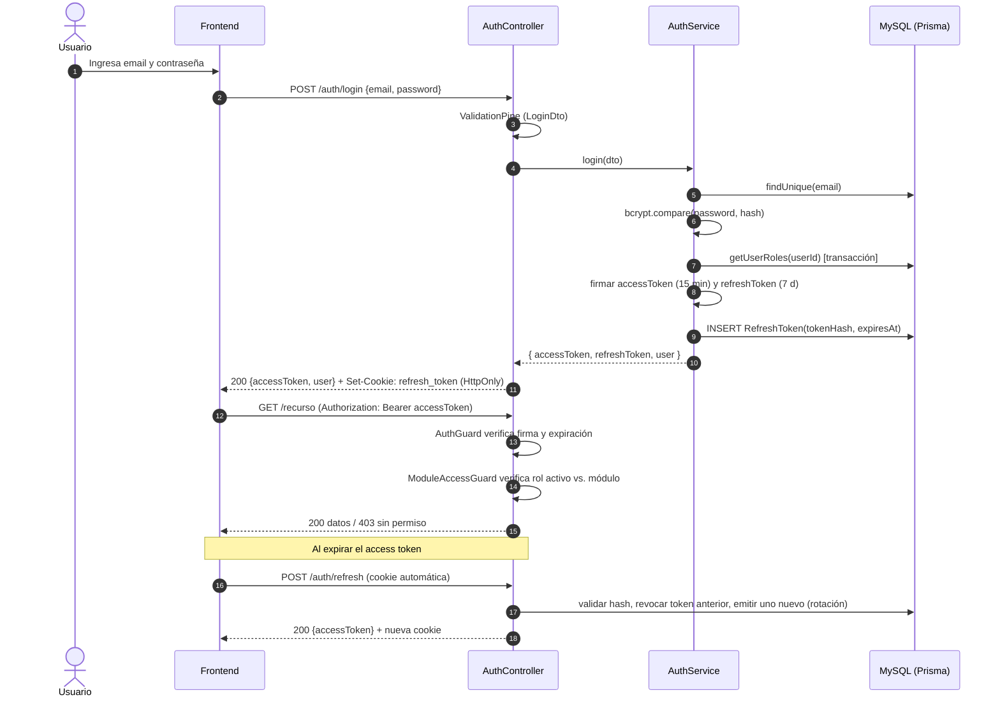
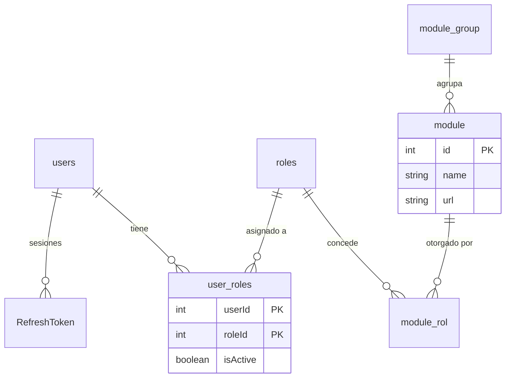

# Informe Técnico: Arquitectura de Acceso a Datos y Seguridad

**Sistema:** SISTEMA-VENTAS-API
**Autor principal:** Saul
**Fecha:** 8 de octubre de 2026
**Versión del documento:** 1.0

**Stack tecnológico**

| Capa | Tecnología |
|---|---|
| Lenguaje | TypeScript 6 (ES Modules) |
| Framework backend | NestJS 12 (`@nestjs/platform-express`) |
| ORM / acceso a datos | Prisma ORM 6 (`prisma-client` generator) |
| Base de datos | MySQL (InnoDB, `utf8mb4_unicode_ci`) |
| Autenticación | `@nestjs/jwt` (JWT HS256), `bcrypt`, `cookie-parser` |
| Validación | `class-validator` + `class-transformer` (`ValidationPipe` global) |
| Observabilidad | `@nestjs/observe` (trazas, métricas y logs correlacionados) |
| Calidad / pruebas | Vitest, Supertest, oxlint, Prettier |

> **Convención de estado.** En las tablas de este informe, cada control se marca como **Implementado** (presente en el código actual del repositorio) o **Planificado** (definido en este diseño y pendiente de integración). Esta distinción permite trazar el avance real frente a la arquitectura objetivo.

---

## 1. Patrón de Diseño de Acceso a Datos

### 1.1 Patrón seleccionado

Se adopta el **Repository Pattern** sobre **Prisma ORM**, integrado con el contenedor de inyección de dependencias (IoC) de NestJS.

El sistema parte de un `PrismaService` (`src/prisma/prisma.service.ts`) que extiende `PrismaClient` y gestiona el ciclo de vida de la conexión (`onModuleInit` / `onModuleDestroy`). Sobre esta base, cada agregado del dominio (`User`, `Role`, `Category`, etc.) expone un **contrato de repositorio** (interfaz TypeScript) y una **implementación concreta** basada en Prisma. Los servicios de negocio dependen únicamente del contrato, nunca del ORM.

### 1.2 Justificación técnica

**¿Por qué Repository y no DAO?**
El patrón DAO se orienta a tablas (una clase por tabla, operaciones CRUD genéricas). El patrón Repository se orienta al **dominio**: expone operaciones con significado de negocio (`findByEmail`, `existsByEmailOrDocument`) y trabaja con agregados completos (p. ej., un `User` junto con sus `UserRole`). Dado que Prisma ya actúa como *Data Mapper* tipado, implementar un DAO adicional duplicaría responsabilidades; el Repository, en cambio, aporta una capa semántica sobre el ORM.

**Separación entre lógica de negocio y persistencia**

| Responsabilidad | Capa | Ejemplo en el sistema |
|---|---|---|
| Reglas de negocio | `UsersService` | Unicidad de email/documento, contraseña inicial, estado `RESTORE` |
| Contrato de persistencia | `UsersRepository` (interfaz) | `findByEmail()`, `create()` |
| Detalle técnico de persistencia | `PrismaUsersRepository` | Consultas Prisma, `select` explícito, relaciones anidadas |
| Conexión y pool | `PrismaService` | `$connect()` / `$disconnect()` |

**Beneficios**

- **Bajo acoplamiento (DIP – SOLID):** el servicio depende de una abstracción inyectada mediante un *token* (`USERS_REPOSITORY`). Sustituir Prisma por otro ORM, o MySQL por PostgreSQL, solo afecta a la implementación del repositorio.
- **Testabilidad:** los servicios se prueban con repositorios *in-memory* o *mocks* de Vitest, sin base de datos.
- **Seguridad por diseño:** el repositorio centraliza las proyecciones (`select`), lo que garantiza que el campo `password` **nunca** salga de la capa de persistencia salvo en el método explícito de autenticación (`findByEmailWithCredentials`). Esto mitiga la exposición accidental de datos sensibles (OWASP A01/A04).
- **Escalabilidad:** permite introducir de forma transparente caché (Redis), réplicas de lectura (CQRS ligero) o *sharding*, sin modificar la lógica de negocio. También facilita la extracción futura de módulos hacia microservicios.
- **Consistencia transaccional:** las operaciones compuestas (p. ej., `syncModules` en roles, activación del rol por defecto en `getUserRoles`) se encapsulan en `prisma.$transaction`, preservando la atomicidad dentro del repositorio.
- **Reutilización:** utilidades transversales como `paginate()` (`src/common/utils/paginate.utils.ts`) se apoyan en una interfaz genérica (`PrismaPaginatedModel<T>`), coherente con el enfoque basado en contratos.

### 1.3 Diagrama de clases

```mermaid
classDiagram
    direction LR

    class PrismaClient {
        <<external>>
        +user: UserDelegate
        +$transaction(fn) Promise
        +$connect() Promise~void~
        +$disconnect() Promise~void~
    }

    class PrismaService {
        <<Injectable>>
        +onModuleInit() Promise~void~
        +onModuleDestroy() Promise~void~
    }

    class UsersRepository {
        <<interface>>
        +findById(id: number) Promise~UserEntity | null~
        +findAll() Promise~UserEntity[]~
        +findByEmailWithCredentials(email: string) Promise~UserCredentials | null~
        +findConflict(email: string, documentNumber: string, excludeId?: number) Promise~Conflict | null~
        +create(data: CreateUserData) Promise~UserEntity~
        +update(id: number, data: UpdateUserData) Promise~UserEntity~
    }

    class PrismaUsersRepository {
        <<Injectable>>
        -prisma: PrismaService
        +findById(id) Promise~UserEntity | null~
        +findAll() Promise~UserEntity[]~
        +findByEmailWithCredentials(email) Promise~UserCredentials | null~
        +findConflict(email, documentNumber, excludeId?) Promise~Conflict | null~
        +create(data) Promise~UserEntity~
        +update(id, data) Promise~UserEntity~
    }

    class UserEntity {
        +id: number
        +documentType: DocumentType
        +documentNumber: string
        +firstName: string
        +lastName: string
        +email: string
        +address: string | null
        +phone: string | null
        +status: StatusUser
        +createdAt: Date
    }

    class UsersService {
        <<Injectable>>
        -usersRepository: UsersRepository
        +create(dto: CreateUserDto) Promise~UserEntity~
        +findAll() Promise~UserEntity[]~
        +findOne(id: number) Promise~UserEntity~
        +update(id: number, dto: UpdateUserDto) Promise~UserEntity~
    }

    class UsersController {
        <<Controller>>
        -usersService: UsersService
        +create(dto: CreateUserDto)
    }

    PrismaClient <|-- PrismaService
    UsersRepository <|.. PrismaUsersRepository : implements
    PrismaUsersRepository --> PrismaService : uses
    PrismaUsersRepository ..> UserEntity : returns
    UsersService --> UsersRepository : depends on (USERS_REPOSITORY)
    UsersService ..> UserEntity : returns
    UsersController --> UsersService : delegates
```



### 1.4 Código fuente

> Extractos representativos. La implementación completa está en `src/users/repositories/` y `src/users/users.service.ts`.

**a) Entidad de dominio y contrato del repositorio**

```typescript
// src/users/repositories/users.repository.ts
import type { DocumentType, StatusUser } from '../../generated/prisma/enums.js';

export const USERS_REPOSITORY = Symbol('USERS_REPOSITORY');

/** Representación pública del usuario: nunca incluye la contraseña. */
export interface UserEntity {
  id: number;
  documentType: DocumentType;
  documentNumber: string;
  firstName: string;
  lastName: string;
  email: string;
  address: string | null;
  phone: string | null;
  status: StatusUser;
  createdAt: Date;
}

/** Proyección exclusiva para autenticación. */
export interface UserCredentials {
  id: number;
  email: string;
  firstName: string;
  lastName: string;
  password: string;
  status: StatusUser;
}

export interface CreateUserData
  extends Omit<UserEntity, 'id' | 'status' | 'createdAt' | 'address' | 'phone'> {
  address?: string;
  phone?: string;
  passwordHash: string;
  status: StatusUser;
  roleIds: number[];
}

export type UpdateUserData = Partial<
  Omit<CreateUserData, 'passwordHash' | 'roleIds'>
>;

export interface UsersRepository {
  findById(id: number): Promise<UserEntity | null>;
  findAll(): Promise<UserEntity[]>;
  findByEmailWithCredentials(email: string): Promise<UserCredentials | null>;
  findConflict(
    email: string,
    documentNumber: string,
    excludeId?: number,
  ): Promise<Pick<UserEntity, 'email' | 'documentNumber'> | null>;
  create(data: CreateUserData): Promise<UserEntity>;
  update(id: number, data: UpdateUserData): Promise<UserEntity>;
}
```

**b) Implementación concreta con Prisma**

```typescript
// src/users/repositories/prisma-users.repository.ts
import { Injectable } from '@nestjs/common';
import { PrismaService } from '../../prisma/prisma.service.js';
import type {
  CreateUserData,
  UpdateUserData,
  UserCredentials,
  UserEntity,
  UsersRepository,
} from './users.repository.js';

/** Proyección única y centralizada: el hash de la contraseña queda excluido. */
const PUBLIC_USER_SELECT = {
  id: true,
  documentType: true,
  documentNumber: true,
  firstName: true,
  lastName: true,
  email: true,
  address: true,
  phone: true,
  status: true,
  createdAt: true,
} as const;

@Injectable()
export class PrismaUsersRepository implements UsersRepository {
  constructor(private readonly prisma: PrismaService) {}

  findById(id: number): Promise<UserEntity | null> {
    return this.prisma.user.findUnique({ where: { id }, select: PUBLIC_USER_SELECT });
  }

  findAll(): Promise<UserEntity[]> {
    return this.prisma.user.findMany({ select: PUBLIC_USER_SELECT });
  }

  findByEmailWithCredentials(email: string): Promise<UserCredentials | null> {
    return this.prisma.user.findUnique({
      where: { email },
      select: {
        id: true,
        email: true,
        firstName: true,
        lastName: true,
        password: true,
        status: true,
      },
    });
  }

  findConflict(email: string, documentNumber: string, excludeId?: number) {
    return this.prisma.user.findFirst({
      where: {
        OR: [{ email }, { documentNumber }],
        ...(excludeId ? { NOT: { id: excludeId } } : {}),
      },
      select: { email: true, documentNumber: true },
    });
  }

  create({ passwordHash, roleIds, ...data }: CreateUserData): Promise<UserEntity> {
    return this.prisma.user.create({
      data: {
        ...data,
        password: passwordHash,
        userRoles: {
          create: roleIds.map((roleId) => ({ role: { connect: { id: roleId } } })),
        },
      },
      select: PUBLIC_USER_SELECT,
    });
  }

  update(id: number, data: UpdateUserData): Promise<UserEntity> {
    return this.prisma.user.update({ where: { id }, data, select: PUBLIC_USER_SELECT });
  }
}
```

**c) Servicio de negocio que consume el contrato**

```typescript
// src/users/users.service.ts
import { ConflictException, Inject, Injectable, NotFoundException } from '@nestjs/common';
import * as bcrypt from 'bcrypt';
import { StatusUser } from '../generated/prisma/enums.js';
import { CreateUserDto } from './dto/create-user.dto.js';
import { UpdateUserDto } from './dto/update-user.dto.js';
import { USERS_REPOSITORY, type UsersRepository } from './repositories/users.repository.js';

const BCRYPT_COST = 12;

@Injectable()
export class UsersService {
  constructor(
    @Inject(USERS_REPOSITORY) private readonly usersRepository: UsersRepository,
  ) {}

  async create(dto: CreateUserDto) {
    await this.assertUnique(dto.email, dto.documentNumber);
    const { roleIds, ...data } = dto;
    // Contraseña inicial temporal; el estado RESTORE obliga a cambiarla en el primer acceso.
    const passwordHash = await bcrypt.hash(dto.documentNumber, BCRYPT_COST);
    return this.usersRepository.create({
      ...data,
      passwordHash,
      roleIds,
      status: StatusUser.RESTORE,
    });
  }

  findAll() {
    return this.usersRepository.findAll();
  }

  async findOne(id: number) {
    const user = await this.usersRepository.findById(id);
    if (!user) throw new NotFoundException(`Usuario con ID ${id} no encontrado`);
    return user;
  }

  async update(id: number, dto: UpdateUserDto) {
    const current = await this.findOne(id);
    if (dto.email || dto.documentNumber) {
      await this.assertUnique(
        dto.email ?? current.email,
        dto.documentNumber ?? current.documentNumber,
        id,
      );
    }
    const { roleIds, ...data } = dto;
    return this.usersRepository.update(id, data);
  }

  private async assertUnique(email: string, documentNumber: string, excludeId?: number) {
    const conflict = await this.usersRepository.findConflict(email, documentNumber, excludeId);
    if (conflict?.email === email) {
      throw new ConflictException('El correo electrónico ya está registrado');
    }
    if (conflict?.documentNumber === documentNumber) {
      throw new ConflictException('El número de documento ya está registrado');
    }
  }
}
```

**d) Registro en el contenedor IoC de NestJS**

```typescript
// src/users/users.module.ts
import { Module } from '@nestjs/common';
import { UsersController } from './users.controller.js';
import { UsersService } from './users.service.js';
import { USERS_REPOSITORY } from './repositories/users.repository.js';
import { PrismaUsersRepository } from './repositories/prisma-users.repository.js';

@Module({
  controllers: [UsersController],
  providers: [
    UsersService,
    { provide: USERS_REPOSITORY, useClass: PrismaUsersRepository },
  ],
  exports: [UsersService, USERS_REPOSITORY],
})
export class UsersModule {}
```

**e) Prueba unitaria sin base de datos (beneficio de testabilidad)**

```typescript
// src/users/users.service.spec.ts (extracto)
const repo: UsersRepository = {
  findConflict: vi.fn().mockResolvedValue({ email: 'saul@ventas.pe', documentNumber: 'x' }),
  // ...resto de métodos simulados
} as unknown as UsersRepository;

const service = new UsersService(repo);
await expect(service.create(dto)).rejects.toThrow('El correo electrónico ya está registrado');
```

---

## 2. Controles de Seguridad Aplicados

### 2.1 Marcos de referencia

- **OWASP Top 10:2025** — riesgos de aplicaciones web (A01–A10).
- **OWASP ASVS 4.0.3** — requisitos verificables (V2 Autenticación, V3 Sesiones, V4 Control de acceso, V5 Validación).
- **ISO/IEC 27001:2022, Anexo A** — controles organizacionales (5.x) y tecnológicos (8.x).
- **NIST SP 800-53 Rev. 5** — catálogo de controles (familias AC, AU, IA, SC, SI).
- **NIST SP 800-63B** — gestión de autenticadores y contraseñas.
- **NIST SP 800-52 Rev. 2** — configuración de TLS.
- **Ley N.º 29733** (Perú) y su reglamento — protección de datos personales (el sistema almacena DNI, pasaporte y carné de extranjería).

### 2.2 Protección de datos en tránsito

| ID | Control | Implementación en el sistema | Estado | Alineación normativa |
|---|---|---|---|---|
| T-01 | Cifrado TLS 1.2+ (preferente 1.3) en toda comunicación cliente–API | Terminación TLS en *reverse proxy* (Nginx/Cloud LB); `app.set('trust proxy', 1)` en NestJS | Planificado | OWASP A04 · ISO 8.24, 8.20 · NIST SC-8, SC-13, SP 800-52r2 |
| T-02 | HSTS y cabeceras de seguridad HTTP | `helmet()` en `main.ts` (HSTS, `X-Content-Type-Options`, `frame-ancestors`, CSP) | Planificado | OWASP A02 · ISO 8.9 · NIST CM-6 |
| T-03 | Cookie de sesión con atributo `Secure` | `secure: process.env.NODE_ENV === 'production'` en `auth.controller.ts` | Implementado | OWASP A07 · ASVS V3.4.1 · NIST SC-23 |
| T-04 | Política CORS restrictiva | `enableCors({ origin: URL_FRONTEND, credentials: true, allowedHeaders: [...] })` | Implementado | OWASP A02 · ISO 8.9 · NIST AC-4 |
| T-05 | Conexión cifrada API–MySQL | `DATABASE_URL` con `sslaccept=strict` y certificado CA del servidor | Planificado | ISO 8.24 · NIST SC-8 |

### 2.3 Protección de datos en reposo

| ID | Control | Implementación en el sistema | Estado | Alineación normativa |
|---|---|---|---|---|
| R-01 | Contraseñas almacenadas con función de *hashing* adaptativa y sal única | `bcrypt.hash(password, cost)`; sal de 128 bits embebida en el hash | Implementado (cost 10; se eleva a 12) | OWASP A04, A07 · ISO 8.5, 5.17 · NIST IA-5(1), SP 800-63B §5.1.1.2 |
| R-02 | *Refresh tokens* almacenados solo como hash | Tabla `RefreshToken.tokenHash` con hash **SHA-256** (ver §3.3) | Implementado | OWASP A04 · NIST SC-28 |
| R-03 | Minimización de datos en respuestas | `select` explícito que excluye `password`; desestructuración `{ password, ...result }` | Implementado | OWASP A01 · ISO 8.12, 5.34 · Ley 29733 |
| R-04 | Gestión de secretos fuera del código fuente | `JWT_ACCESS_SECRET`, `JWT_REFRESH_SECRET`, `DATABASE_URL` vía `ConfigService.getOrThrow`; `.env*` en `.gitignore`. Pendiente: mover `appKey/appSecret` de Observe a variables de entorno | Implementado parcialmente | OWASP A02, A04 · ISO 8.24 · NIST SC-12 |
| R-05 | Cifrado del almacenamiento de la BD y respaldos | InnoDB *tablespace encryption* + respaldos cifrados (AES-256) | Planificado | ISO 8.13, 8.24 · NIST SC-28, CP-9 |

### 2.4 Validación de entradas

| ID | Control | Implementación en el sistema | Estado | Alineación normativa |
|---|---|---|---|---|
| V-01 | Validación declarativa por *allow-list* en todos los endpoints | `ValidationPipe` global con `whitelist: true`, `forbidNonWhitelisted: true`, `transform: true` | Implementado | OWASP A05, A06 · ASVS V5.1 · ISO 8.28 · NIST SI-10 |
| V-02 | Prevención de *Mass Assignment* | Propiedades no declaradas en el DTO se rechazan (HTTP 400) | Implementado | OWASP A01 · ASVS V5.1.2 |
| V-03 | Tipado y reglas por campo | DTOs con `@IsEmail`, `@IsEnum(DocumentType)`, `@IsInt({ each: true })`, `@ValidateNested` + `@Type` | Implementado | NIST SI-10 |
| V-04 | Validación de parámetros de ruta | Sustituir `+id` por `@Param('id', ParseIntPipe)` para rechazar valores no numéricos | Planificado | OWASP A05, A10 · NIST SI-10 |
| V-05 | Límites de longitud y formato | `@MaxLength`, `@Matches` (p. ej., DNI de 8 dígitos), `@IsEmail` en `LoginDto`; límite de *body* (`json({ limit: '100kb' })`) | Planificado | OWASP A06 · NIST SC-5 |

### 2.5 Prevención de inyecciones (SQLi / XSS)

| ID | Control | Implementación en el sistema | Estado | Alineación normativa |
|---|---|---|---|---|
| I-01 | Consultas parametrizadas | Prisma Client genera *prepared statements*; no existe uso de `$queryRaw`/`$executeRaw` en el código | Implementado | OWASP A05 · ASVS V5.3.4 · ISO 8.28 · NIST SI-10 |
| I-02 | Prohibición de SQL dinámico inseguro | Regla de revisión de código y *lint*: vetar `$queryRawUnsafe` / `$executeRawUnsafe` | Planificado | OWASP A05 · ISO 8.25 |
| I-03 | Ordenamiento dinámico seguro | `PaginationDto.column` y `sortDirection` validados con `@IsIn([...])` (lista blanca de columnas) | Planificado | OWASP A05 |
| I-04 | Mitigación de XSS | La API responde exclusivamente `application/json` (+ `X-Content-Type-Options: nosniff`); el frontend renderiza con escape automático y CSP | Implementado (API) / Planificado (CSP) | OWASP A05 · ASVS V5.3.3 |
| I-05 | Reducción del impacto de XSS sobre la sesión | *Refresh token* en cookie `HttpOnly` (inaccesible a JavaScript); *access token* solo en memoria del cliente, nunca en `localStorage` | Implementado (API) | OWASP A07 · ASVS V3.4.2 |

### 2.6 Autenticación, control de acceso y resiliencia

| ID | Control | Implementación en el sistema | Estado | Alineación normativa |
|---|---|---|---|---|
| A-01 | Denegación por defecto | `AuthGuard` registrado como `APP_GUARD`; solo las rutas con `@Public()` son anónimas | Implementado | OWASP A01 · ISO 5.15, 8.3 · NIST AC-3, AC-6 |
| A-02 | Autorización por rol/módulo (RBAC) | `ModuleAccessGuard` + `@RequireModule()` sobre la relación `Role ↔ ModuleRol ↔ Module` (ver §3.5) | Implementado | OWASP A01 · ISO 5.18, 8.2 · NIST AC-2, AC-3 |
| A-03 | Protección contra fuerza bruta | `@nestjs/throttler` (p. ej., 5 intentos/min en `/auth/login`) + bloqueo progresivo por cuenta | Planificado | OWASP A07 · NIST AC-7 · SP 800-63B §5.2.2 |
| A-04 | Mensajes de error genéricos | "Credenciales incorrectas" para usuario inexistente o clave errónea; el estado `DISABLED` se evalúa **después** de validar la contraseña para evitar enumeración; hash ficticio para igualar tiempos | Implementado | OWASP A07 · ASVS V2.2 · NIST SI-11 |
| A-05 | Manejo controlado de excepciones | `ExceptionFilter` global que no expone *stack traces* ni errores de Prisma (`P2002`, `P2025`) al cliente | Planificado | OWASP A10 · ISO 8.28 · NIST SI-11 |

### 2.7 Registro de auditoría (logging) y monitoreo

| ID | Control | Implementación en el sistema | Estado | Alineación normativa |
|---|---|---|---|---|
| L-01 | Telemetría centralizada | `@nestjs/observe`: trazas distribuidas, métricas por solicitud y logs correlacionados por *trace id* | Implementado | OWASP A09 · ISO 8.15, 8.16 · NIST AU-2, AU-6 |
| L-02 | Bitácora de eventos de seguridad | Tabla `audit_log` (usuario, IP, *user-agent*, acción, recurso, resultado, *timestamp* UTC) para: login exitoso/fallido, logout, refresco y revocación de tokens, cambios de rol y de permisos, altas/bajas de usuarios | Planificado | OWASP A09 · ISO 8.15 · NIST AU-3, AU-12 |
| L-03 | Exclusión de datos sensibles en logs | Nunca registrar contraseñas, tokens, cabecera `Authorization` ni cookies; enmascarar número de documento | Planificado | ISO 8.11, 8.15 · NIST AU-9 · Ley 29733 |
| L-04 | Integridad y retención | Logs *append-only* exportados a almacenamiento inmutable; retención mínima de 1 año; sincronización horaria NTP | Planificado | ISO 8.15, 8.17 · NIST AU-9, AU-11, AU-8 |
| L-05 | Alertas | Umbrales de alerta ante picos de HTTP 401/403 o múltiples fallos de login desde una misma IP | Planificado | OWASP A09 · ISO 8.16 · NIST SI-4 |

### 2.8 Cadena de suministro y ciclo de desarrollo seguro

| ID | Control | Implementación en el sistema | Estado | Alineación normativa |
|---|---|---|---|---|
| S-01 | Análisis estático y estilo | `oxlint` + Prettier + TypeScript estricto | Implementado | ISO 8.25, 8.28 |
| S-02 | Pruebas automatizadas | Vitest (unitarias) y Supertest (e2e) | Implementado | ISO 8.29 · NIST SA-11 |
| S-03 | Auditoría de dependencias | `npm audit` / Dependabot en CI; *lockfile* versionado | Planificado | OWASP A03 · ISO 8.8 · NIST RA-5, SR-3 |
| S-04 | Migraciones versionadas | `prisma/migrations/*` bajo control de versiones; despliegue con `prisma migrate deploy` | Implementado | ISO 8.32 · NIST CM-3 |

---

## 3. Módulo de Login Seguro y Control de Acceso (RBAC)

### 3.1 Justificación técnica del flujo de autenticación

El sistema implementa un esquema **stateless de doble token** (*access token* + *refresh token*) sobre JWT:

| Token | Contenido | Vida útil | Transporte / almacenamiento | Secreto |
|---|---|---|---|---|
| **Access token** | `sub`, `email`, nombres, `roles[]` (con rol activo), `type: 'access'` | Corta (`JWT_ACCESS_EXPIRES_IN`, recomendado 15 min) | Cuerpo de la respuesta → memoria del cliente → cabecera `Authorization: Bearer` | `JWT_ACCESS_SECRET` |
| **Refresh token** | `sub`, `type: 'refresh'`, `jti` | Larga (`JWT_REFRESH_EXPIRES_IN`, 7 días) | Cookie `HttpOnly`; en BD solo su hash | `JWT_REFRESH_SECRET` (distinto) |

**Razones por las que el flujo es seguro**

1. **Separación de secretos:** un *access token* no puede usarse como *refresh token* ni viceversa (secretos y claim `type` distintos).
2. **Ventana de exposición reducida:** si un *access token* se filtra, caduca en minutos.
3. **Resistencia a XSS:** el *refresh token*, que es la credencial de larga duración, reside en una cookie `HttpOnly` inaccesible desde JavaScript.
4. **Resistencia a CSRF:** la cookie usa `SameSite=Lax` y las operaciones protegidas exigen la cabecera `Authorization`, que un sitio de terceros no puede adjuntar. El endpoint de refresco aplica además verificación de `Origin`.
5. **Revocabilidad:** al persistir el hash del *refresh token* con `expiresAt` y `revokedAt`, el servidor puede invalidar sesiones (logout, cambio de contraseña, cuenta deshabilitada), algo que un JWT puro no permite.
6. **Denegación por defecto:** el `AuthGuard` global protege toda ruta salvo las marcadas explícitamente con `@Public()`.

**Diagrama de secuencia del flujo**



### 3.2 Evidencias descritas: formulario de autenticación (frontend)

> *Nota:* el frontend se mantiene en un repositorio independiente que consume esta API (origen autorizado mediante `URL_FRONTEND`). Insertar capturas en los marcadores indicados.

**Estructura visual**

- Vista centrada con el logotipo y el nombre del sistema de ventas, seguida de una tarjeta con el título **"Iniciar sesión"**.
- **Campo "Correo electrónico"** (`type="email"`, `autocomplete="username"`), obligatorio, con validación de formato en el cliente.
- **Campo "Contraseña"** (`type="password"`, `autocomplete="current-password"`) con botón para mostrar/ocultar el contenido; el valor nunca se persiste en el navegador.
- Botón **"Ingresar"**, que se deshabilita y muestra un indicador de carga mientras la solicitud está en curso (evita envíos duplicados).
- Zona de mensajes de error accesible (`role="alert"`).

`[Insertar captura 1: formulario de login en estado inicial]`

**Comportamiento funcional**

1. Si los campos están vacíos o el email es inválido, el formulario muestra el error junto al campo sin contactar la API.
2. Al enviar, se realiza `POST /auth/login` con `credentials: 'include'` para recibir la cookie `refresh_token`.
3. Ante credenciales inválidas, la API responde **401 "Credenciales incorrectas"** y el formulario muestra ese mensaje genérico, sin revelar si el correo existe.
   `[Insertar captura 2: mensaje de credenciales incorrectas]`
4. Ante éxito (200), el *access token* se guarda **en memoria** (estado de la aplicación), se decodifica la lista `roles[]` y se redirige al panel principal.
5. Si el usuario tiene estado `RESTORE` (alta reciente con contraseña inicial), se le redirige obligatoriamente a la pantalla de cambio de contraseña.
6. Si el usuario posee varios roles, se muestra un selector de rol; el menú lateral se construye con los módulos (`ModuleGroup → Module`) asociados al **rol activo**.
   `[Insertar captura 3: panel principal con menú filtrado por rol]`
7. En la pestaña *Network* de las herramientas del navegador puede evidenciarse la cabecera `Set-Cookie: refresh_token=...; HttpOnly; SameSite=Lax; Secure` y que `document.cookie` **no** expone dicho valor.
   `[Insertar captura 4: cookie HttpOnly en DevTools]`

### 3.3 Gestión segura de credenciales

**Algoritmo:** **bcrypt** (basado en Blowfish/EksBlowfish), implementado con la librería nativa `bcrypt` v6.

| Aspecto | Decisión | Fundamento |
|---|---|---|
| Sal (*salt*) | 128 bits aleatorios generados por `bcrypt.hash` para cada contraseña y embebidos en el propio hash (`$2b$<cost>$<salt><hash>`) | Impide ataques con tablas *rainbow* y que dos usuarios con la misma clave tengan el mismo hash |
| Factor de costo | Actualmente `10`; se establece `12` como objetivo (~250 ms por verificación en hardware de servidor) | Ralentiza ataques de fuerza bruta *offline*; ajustable conforme mejora el hardware (NIST SP 800-63B §5.1.1.2) |
| Comparación | `bcrypt.compare()` en tiempo constante | Previene ataques de temporización sobre el hash |
| Longitud máxima | Validar ≤ 72 bytes en el DTO (límite interno de bcrypt) | Evita truncamiento silencioso |
| Contraseña inicial | Al crear un usuario se usa una clave temporal y el estado `RESTORE`, que **obliga** a cambiarla en el primer acceso | ISO 27001 5.17 (información de autenticación) |
| Política de contraseñas | Mínimo 8 caracteres (12 recomendado), sin reglas de composición arbitrarias, verificación contra listas de contraseñas comprometidas | NIST SP 800-63B §5.1.1.2 |
| Alternativa evaluada | **Argon2id** (ganador de la *Password Hashing Competition*, resistente a GPU por consumo de memoria) | Ruta de migración: re-hash transparente al siguiente login exitoso |

**Almacenamiento del *refresh token*.** El *refresh token* es un valor de alta entropía generado por el servidor, por lo que no requiere una función lenta; se almacena como **SHA-256**. Además, bcrypt solo procesa los primeros 72 bytes de su entrada, y en un JWT esos bytes corresponden casi íntegramente a la cabecera y al inicio del *payload*, comunes a todos los tokens de un mismo usuario; usar bcrypt sobre el JWT completo reduciría la unicidad efectiva del hash.

### 3.4 Control de autorización y gestión de sesiones

**Modelo RBAC del sistema**



- Un **usuario** puede tener **múltiples roles** (`user_roles`), pero opera con **un único rol activo** (`isActive = true`). Si ninguno está activo, `getUserRoles()` activa el primero de forma transaccional.
- Cada **rol** concede acceso a un conjunto de **módulos** (`module_rol`), agrupados en `module_group` para construir el menú.
- La **autorización** se evalúa en dos niveles:
  1. **Autenticación (`AuthGuard`, global):** verifica firma y vigencia del JWT y adjunta el *payload* a `request.user`.
  2. **Autorización (`ModuleAccessGuard`):** cada controlador declara el módulo que protege con `@RequireModule(AppModules.USERS)`. El guard consulta en BD si el **rol activo** del usuario tiene ese módulo asignado. Consultar la BD (y no solo el JWT) garantiza que la revocación de un permiso surta efecto inmediato. Este principio aplica **mínimo privilegio** (NIST AC-6) y **denegación por defecto**.

**Ciclo de vida de la sesión**

| Evento | Acción del servidor |
|---|---|
| Login | Emite *access token* (15 min) y *refresh token* (7 días, con `jti` único); guarda `sha256(refreshToken)` |
| Petición autenticada | `AuthGuard` valida el *access token* recibido en `Authorization: Bearer` |
| Expiración del *access token* | El cliente invoca `POST /auth/refresh`; la cookie viaja automáticamente |
| Refresco | Se valida firma, `type`, existencia del hash, `revokedAt IS NULL` y `expiresAt > now`; se **revoca** el token usado y se emite un par nuevo (**rotación**) |
| Reutilización de un token revocado | Se interpreta como robo de token: se revocan **todas** las sesiones del usuario y se registra un evento de auditoría |
| Logout | Se marca `revokedAt` y se elimina la cookie (`clearCookie`) |
| Cambio de contraseña / deshabilitar cuenta | Revocación masiva de los *refresh tokens* del usuario |

**Atributos de la cookie:** `HttpOnly`, `Secure` (producción), `SameSite=Lax`, `Max-Age` de 7 días y `Path=/auth` (restringe el envío de la cookie a los endpoints de autenticación).

### 3.5 Código fuente

> Extractos representativos. La implementación completa está en `src/auth/` (`auth.controller.ts`, `auth.service.ts`, `module-access.guard.ts`, `app-modules.ts`).

**a) Controlador de autenticación**

```typescript
// src/auth/auth.controller.ts
import { Body, Controller, HttpCode, Post, Req, Res, UnauthorizedException } from '@nestjs/common';
import type { CookieOptions, Request, Response } from 'express';
import { AuthService } from './auth.service.js';
import { LoginDto } from './dto/login.dto.js';
import { Public } from './decorators/public.decorator.js';

const REFRESH_COOKIE = 'refresh_token';
const refreshCookieOptions: CookieOptions = {
  httpOnly: true,
  secure: process.env.NODE_ENV === 'production',
  sameSite: 'lax',
  path: '/auth',
  maxAge: 7 * 24 * 60 * 60 * 1000,
};

@Controller('auth')
export class AuthController {
  constructor(private readonly authService: AuthService) {}

  @Post('login')
  @Public()
  @HttpCode(200)
  async login(@Body() dto: LoginDto, @Res({ passthrough: true }) res: Response) {
    const { accessToken, refreshToken, user } = await this.authService.login(dto);
    res.cookie(REFRESH_COOKIE, refreshToken, refreshCookieOptions);
    return { accessToken, user };
  }

  @Post('refresh')
  @Public()
  @HttpCode(200)
  async refresh(@Req() req: Request, @Res({ passthrough: true }) res: Response) {
    const token = req.cookies?.[REFRESH_COOKIE];
    if (!token) throw new UnauthorizedException('Sesión no válida');
    const tokens = await this.authService.refresh(token);
    res.cookie(REFRESH_COOKIE, tokens.refreshToken, refreshCookieOptions);
    return { accessToken: tokens.accessToken };
  }

  @Post('logout')
  @Public()
  @HttpCode(204)
  async logout(@Req() req: Request, @Res({ passthrough: true }) res: Response) {
    await this.authService.logout(req.cookies?.[REFRESH_COOKIE]);
    res.clearCookie(REFRESH_COOKIE, { ...refreshCookieOptions, maxAge: undefined });
  }
}
```

**b) Servicio de autenticación**

```typescript
// src/auth/auth.service.ts (extracto)
import { Injectable, UnauthorizedException } from '@nestjs/common';
import { ConfigService } from '@nestjs/config';
import { JwtService } from '@nestjs/jwt';
import * as bcrypt from 'bcrypt';
import { createHash, randomUUID } from 'node:crypto';
import { PrismaService } from '../prisma/prisma.service.js';
import { LoginDto } from './dto/login.dto.js';

// Hash ficticio (generado al iniciar) para igualar el tiempo de respuesta cuando el email no existe.
const DUMMY_HASH = bcrypt.hashSync(randomUUID(), 12);
const sha256 = (value: string) => createHash('sha256').update(value).digest('hex');

@Injectable()
export class AuthService {
  constructor(
    private readonly prisma: PrismaService,
    private readonly jwt: JwtService,
    private readonly config: ConfigService,
  ) {}

  async login({ email, password }: LoginDto) {
    const user = await this.prisma.user.findUnique({ where: { email } });
    const passwordValid = await bcrypt.compare(password, user?.password ?? DUMMY_HASH);

    // Mensaje único: no revela si el email existe ni si la cuenta está deshabilitada.
    if (!user || !passwordValid || user.status === 'DISABLED') {
      throw new UnauthorizedException('Credenciales incorrectas');
    }
    return {
      ...(await this.issueTokens(user.id)),
      user: { id: user.id, email: user.email, firstName: user.firstName, lastName: user.lastName },
    };
  }

  async refresh(token: string) {
    const payload = await this.jwt
      .verifyAsync<{ sub: number; type: string }>(token, {
        secret: this.config.getOrThrow('JWT_REFRESH_SECRET'),
      })
      .catch(() => {
        throw new UnauthorizedException('Sesión no válida');
      });
    if (payload.type !== 'refresh') throw new UnauthorizedException('Sesión no válida');

    const stored = await this.prisma.refreshToken.findFirst({
      where: { tokenHash: sha256(token), userId: payload.sub },
    });
    if (!stored || stored.expiresAt < new Date()) {
      throw new UnauthorizedException('Sesión no válida');
    }
    if (stored.revokedAt) {
      // Reutilización de un token ya rotado: posible robo. Se cierran todas las sesiones.
      await this.revokeAll(payload.sub);
      throw new UnauthorizedException('Sesión no válida');
    }
    await this.prisma.refreshToken.update({
      where: { id: stored.id },
      data: { revokedAt: new Date() },
    });
    return this.issueTokens(payload.sub);
  }

  async logout(token?: string) {
    if (!token) return;
    await this.prisma.refreshToken.updateMany({
      where: { tokenHash: sha256(token), revokedAt: null },
      data: { revokedAt: new Date() },
    });
  }

  revokeAll(userId: number) {
    return this.prisma.refreshToken.updateMany({
      where: { userId, revokedAt: null },
      data: { revokedAt: new Date() },
    });
  }

  private async issueTokens(userId: number) {
    const user = await this.prisma.user.findUniqueOrThrow({ where: { id: userId } });
    const accessToken = await this.jwt.signAsync(
      {
        sub: user.id,
        email: user.email,
        fullName: `${user.lastName} ${user.firstName}`,
        roles: await this.getUserRoles(user.id),
        type: 'access',
      },
      {
        secret: this.config.getOrThrow('JWT_ACCESS_SECRET'),
        expiresIn: this.config.getOrThrow('JWT_ACCESS_EXPIRES_IN'),
      },
    );
    const refreshToken = await this.jwt.signAsync(
      { sub: user.id, type: 'refresh', jti: randomUUID() },
      {
        secret: this.config.getOrThrow('JWT_REFRESH_SECRET'),
        expiresIn: this.config.getOrThrow('JWT_REFRESH_EXPIRES_IN'),
      },
    );
    await this.prisma.refreshToken.create({
      data: {
        userId: user.id,
        tokenHash: sha256(refreshToken),
        expiresAt: new Date(Date.now() + 7 * 24 * 60 * 60 * 1000),
      },
    });
    return { accessToken, refreshToken };
  }

  // getUserRoles(userId): ver implementación en src/auth/auth.service.ts
}
```

**c) Autorización basada en roles y módulos**

```typescript
// src/auth/decorators/require-module.decorator.ts
import { SetMetadata } from '@nestjs/common';

export const REQUIRED_MODULE_KEY = 'requiredModule';
export const RequireModule = (moduleUrl: string) => SetMetadata(REQUIRED_MODULE_KEY, moduleUrl);
```

```typescript
// src/auth/module-access.guard.ts
import { CanActivate, ExecutionContext, ForbiddenException, Injectable } from '@nestjs/common';
import { Reflector } from '@nestjs/core';
import { PrismaService } from '../prisma/prisma.service.js';
import { REQUIRED_MODULE_KEY } from './decorators/require-module.decorator.js';
import type { RequestWithUser } from './auth.guard.js';

@Injectable()
export class ModuleAccessGuard implements CanActivate {
  constructor(
    private readonly reflector: Reflector,
    private readonly prisma: PrismaService,
  ) {}

  async canActivate(context: ExecutionContext): Promise<boolean> {
    const moduleUrl = this.reflector.getAllAndOverride<string>(REQUIRED_MODULE_KEY, [
      context.getHandler(),
      context.getClass(),
    ]);
    if (!moduleUrl) return true; // Ruta autenticada sin restricción de módulo

    const { user } = context.switchToHttp().getRequest<RequestWithUser>();
    // Se consulta la BD: un permiso revocado surte efecto sin esperar a que expire el JWT.
    const allowed = await this.prisma.moduleRol.count({
      where: {
        module: { url: moduleUrl },
        rol: { userRoles: { some: { userId: user.sub, isActive: true } } },
      },
    });
    if (!allowed) {
      throw new ForbiddenException('No tiene permisos para acceder a este recurso');
    }
    return true;
  }
}
```

```typescript
// Registro global (src/auth/auth.module.ts): el orden define la cadena autenticación → autorización
providers: [
  AuthService,
  { provide: APP_GUARD, useClass: AuthGuard },
  { provide: APP_GUARD, useClass: ModuleAccessGuard },
],

// Uso en un controlador protegido
@Controller('roles')
@RequireModule(AppModules.ROLES)
export class RolesController { /* ... */ }
```

### 3.6 Enlaces

- **Repositorio del código fuente:** [Insertar enlace al repositorio aquí]
- **Archivos clave:**
  - `src/auth/auth.controller.ts` — endpoints de login, refresco y logout
  - `src/auth/auth.service.ts` — emisión, rotación y revocación de tokens
  - `src/auth/auth.guard.ts` — guard global de autenticación JWT
  - `src/auth/decorators/public.decorator.ts` — excepción explícita a la denegación por defecto
  - `prisma/schema.prisma` — modelos `User`, `Role`, `UserRole`, `Module`, `ModuleRol`, `RefreshToken`

---

## 4. Conclusiones

1. La adopción del **Repository Pattern sobre Prisma** desacopla la lógica de negocio de la persistencia, centraliza las proyecciones de datos sensibles y habilita pruebas unitarias aisladas.
2. Los controles de seguridad se alinean con **OWASP Top 10:2025, ISO/IEC 27001:2022 y NIST SP 800-53/800-63B**. La base implementada (validación por *allow-list*, consultas parametrizadas, *hashing* bcrypt, guard global con denegación por defecto, cookie `HttpOnly`) ofrece una postura sólida, y los controles planificados (rate limiting, `helmet`, auditoría persistente, RBAC por módulo) cierran las brechas restantes.
3. El esquema de **doble token con rotación y revocación** equilibra la escalabilidad de JWT *stateless* con la capacidad de invalidar sesiones del lado del servidor.

### Hoja de ruta priorizada

| Prioridad | Acción |
|---|---|
| Alta | Rate limiting en `/auth/login` con `@nestjs/throttler` |
| Media | `helmet()`, `ParseIntPipe` en parámetros `:id`, `@IsEmail`/`@MaxLength` en `LoginDto`, mover las claves de Observe a `.env` |
| Media | Tabla `audit_log` y `ExceptionFilter` global |
| Baja | Evaluar migración a Argon2id; cifrado de BD y respaldos |
